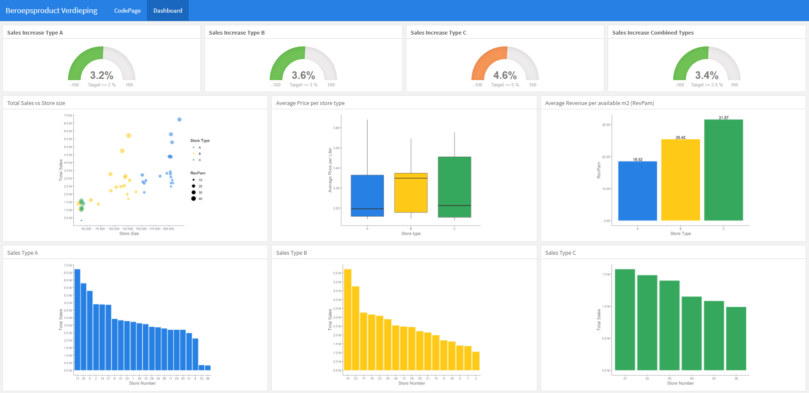

# BSc Store Data

## Project Summary
In this project three csv datafiles are analysed using various techniques. 
The datafiles contain sales data of 40 different stores from January 2010 to December 2012. All 40 stores are categorized in three different store types, A, B and C. The outcome of this analysis is a dashbboard designed with flexdashboard. It highlights the results per type of store. 
<br>
Gauge charts measure sales results quarter 2 2012 vs 2nd quarter 2011. 


---

## Techniques Used
- Format dates to ISO standard notation
- Create an in-memory SQLite database
- Join database tables using SQL
- Create new R-dataframes using SQL
- Join R dataframes using R language
- Store variables using R language
- Format dates using Lubridate
- Customized theme
- Create various plots using GGplot
- Create dashboard using Flexdashboard
<br>
<br>

---

## Outcome

<br>
<br>

---

## Code Examples
<br>

### Create SQLite in-memory database
<br>

```r
{r, echo=TRUE}

# All 3 dataframes are stored as tables in an in-memory SQLite database.
# Because our data is stored in a database, we can apply SQL to transform the data.

# Create an ephemeral in-memory RSQLite database
    con <- dbConnect(RSQLite::SQLite(), dbname = ":memory:")

#Add data sources to the 'in memory' sql database
    copy_to(con,stores,"storesSQL")
    copy_to(con,sales, "salesSQL")
    copy_to(con,features, "featuresSQL")
```
<br>

### Join tables using SQL
<br>

```sql
{sql, echo=TRUE, connection=con, label='Join2', output.var="JoinedTables"}

/*The weeklySalesPerStoreSQL table is joined with featuresSQL table.
  The store Id and Dates are used as keys, to find the correct temperature and Fuel_Price in featuresSQL.   Because we joined the 2 tables, we can now calculate the sold liters and add as a new column.
  Here is also where the advantage of storing dates in ISO Character notation comes into play.
  We can no apply the SQL function strftime(), to subtract the years or other dateparts.
  This wouldn't have been possible otherwise using SQL.*/

  SELECT w.Store as store, w.Date as sellWeek, totalSales, Temperature as temperature, 
    Fuel_Price as fuelPrice, totalSales / Fuel_Price as soldLiters, 
    strftime('%Y', w.Date) as sellYear, strftime('%m', w.Date) as sellMonth
  FROM weeklySalesPerStoreSQL as w
  INNER JOIN featuresSQL as f
    ON w.Store = f.Store
    AND w.Date = f.Date;
```
<br>

### Join tables using R
<br>

```R
{r, echo=TRUE}

# In this chunk I  join data frames using R-language.

# by joining these dataframes i can calculate additional key measures. RevPam and AvgPrice.
# RevPam = revenue per available meter, avg price is average price per sold liter for each store
statsPerStore <- JoinedTables%>%
  group_by(store)%>%
  summarise(totalSales = sum(totalSales), soldLiters=sum(soldLiters))%>%
  inner_join(stores, by = c("store"= "Store"))%>%
  transmute(Store = store,
            totalSales = totalSales,
            size = Size,
            type = Type,
            soldLiters = soldLiters
          )%>%
    mutate(revPam = totalSales / size, 
         avgPrice = totalSales / soldLiters) 

# storecount per type is needed to calculate the average pricing per store type
storeCount <- stores %>%
  select(Type)%>%
  group_by(Type)%>%
  count(Type, name = "Count")

# by joining these dataframes i can calculate the same measures but now for each store type.
statsPerType <- statsPerStore %>%
  group_by(type)%>%
  summarise(totalSales=sum(totalSales), 
            totalSize=sum(size),
            totalLiters = sum(soldLiters)
            )%>%
  inner_join(storeCount, by = c("type" = "Type"))%>%
  mutate(revPam = totalSales / totalSize,
         avgPrice = totalSales / totalLiters,
         avgSalesType = totalSales / Count
         )
```